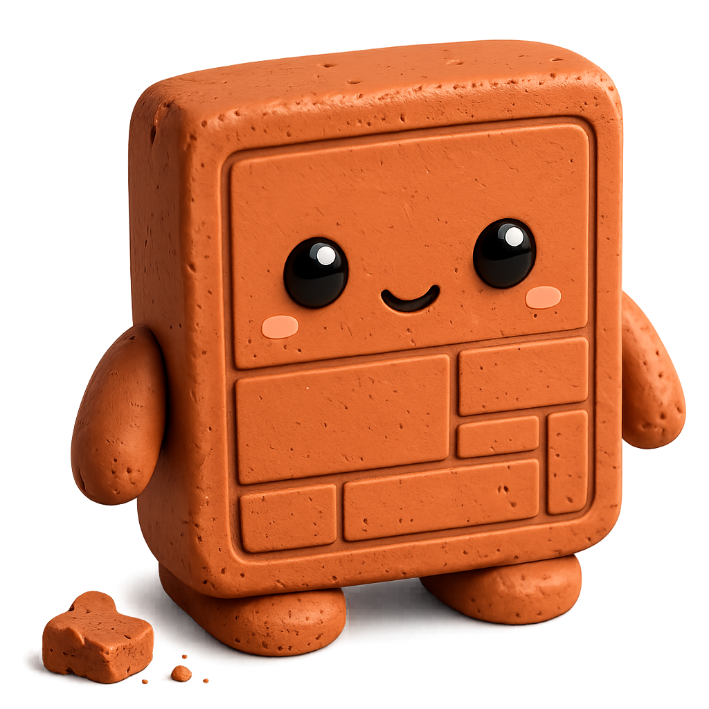

# Terrocotta - Clay meets Roc

<div align="center">
    
</div>

Terrocotta is a library for building native applications in [Roc](https://roc-lang.org/).

This is an **experimental project** to play with and test the performance of Roc and learn about GUI internals.

## Features

- Model-View-Update (MVU) architecture.
- [Clay](https://github.com/nicbarker/clay) layout engine ported to Roc.
  - [x] Stack-based node layout (capacity + exponential growth allocation)
  - [x] Flexbox
  - [x] Mouse/Keyboard Events
  - [x] Scrollable
  - [x] Text wrapping
  - [x] Text measurement caching
  - [x] Floating
  - [ ] Transitions
- Rendering: [roc-ray](https://github.com/lukewilliamboswell/roc-ray) platform built on [raylib](https://www.raylib.com/).
- Vector canvas elements for custom line-and-circle visualizations.
- [x] Status based styling (hovered/pressed/focused)
- [x] Theming
- Widgets
  - [x] Button
  - [x] Slider
  - [x] Checkbox
  - [x] Toggle
  - [x] Select
  - [ ] Input Text

NB: Theming and widgets are just proof of concept implementations. Users are expected to build their own UI toolkit on top of the 3 unique elements: `box(id, style, events, children)`, `text(content)`, `image(blob)`.

## Documentation

- [Architecture Overview](docs/architecture.md)
- [Text Measurement Cache](docs/text_cache.md)

## Examples

Quick counter example:

```roc
import terrocotta.Element exposing [box, text, style, View]

AppModel : { count : I32 }

Msg : [Decrement, Increment]

init! : Config => Try(AppModel, [Exit(I64), ..])
init! = |_config| Ok({ count: 0 })

update : AppModel, Msg -> AppModel
update = |model, msg| match msg {
	Decrement => { ..model, count: model.count - 1 }
	Increment => { ..model, count: model.count + 1 }
}

white = 0xFFFFFF.Color
blue = 0x2196F3.Color

button : Str, Msg -> View(Msg)
button = |label, msg| {
	box(
	  # id
		Auto,
		# style (status-based)
		|status| style
			.width(Fit({ min: 0, max: 10000 }))
			.pad((8, 8, 8, 8))
			.background(if status.hovered { blue.darken(50) } else { blue })
			.font_color(white)
			.font_size(16),
		# events
		[OnClick(msg)],
		# children
		[
			text(label),
		],
	)
}

view : AppModel -> View(Msg)
view = |model| {
	box(
		Auto,
		|_| style.direction(Row).height(Fit({ min: 0, max: 10000 })).gap(8).font_size(16),
		[],
		[
			button("-", Decrement),
			text("Count: ${model.count.to_str()}"),
			button("+", Increment),
		],
	)
}
```

Find more examples at:
- `roc build examples/screwbot.roc && ./screwbot` — interactive 3D PGA inverse-kinematics workbench in a textured, GPU-shaded warehouse with orbit controls, additive lighting, and a responsive live-coefficient inspector
- `roc examples/counter.roc`
- `roc examples/widgets.roc`
- `roc examples/text_wrap.roc`
- `roc examples/scrollable.roc`
- `roc examples/floating.roc`

## Testing

```bash
roc test package/main.roc
```
