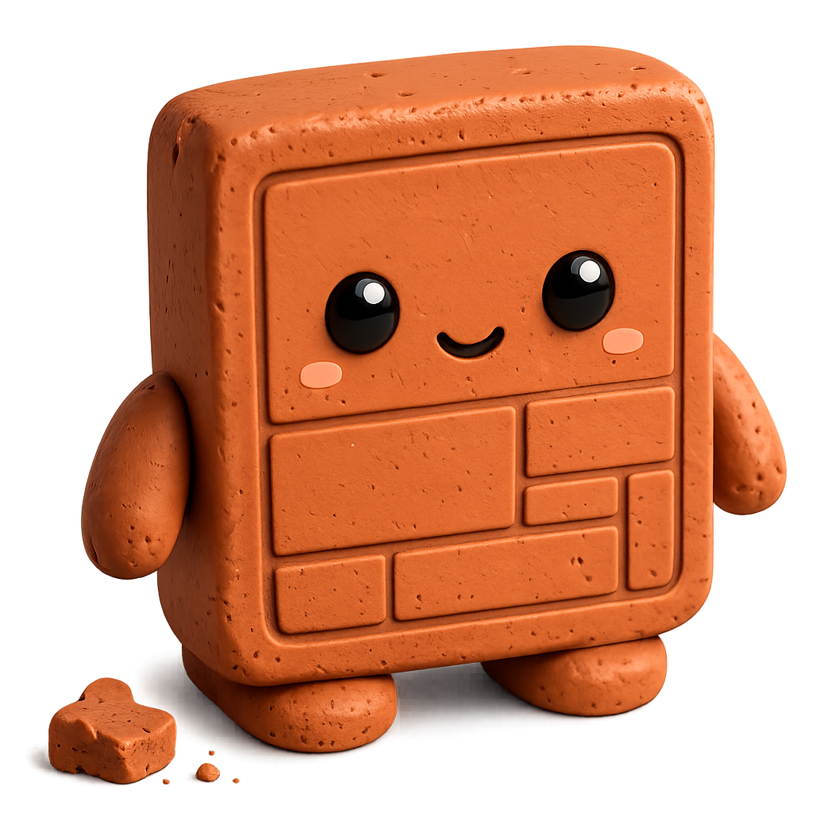
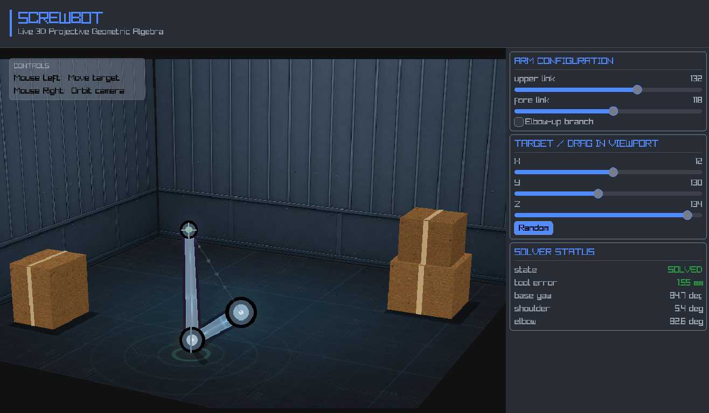
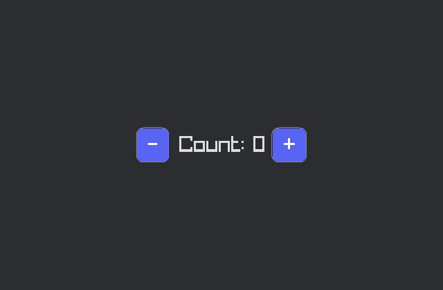
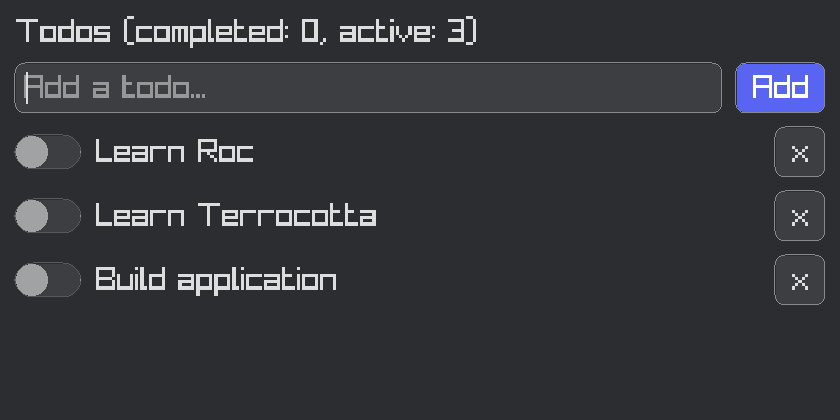
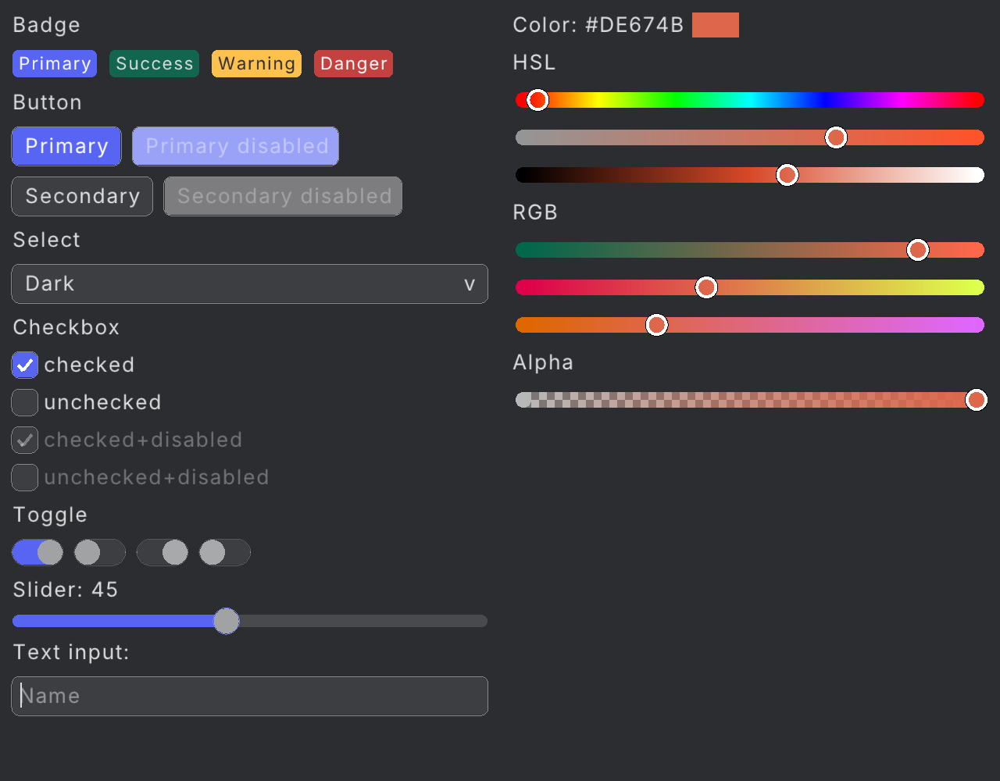
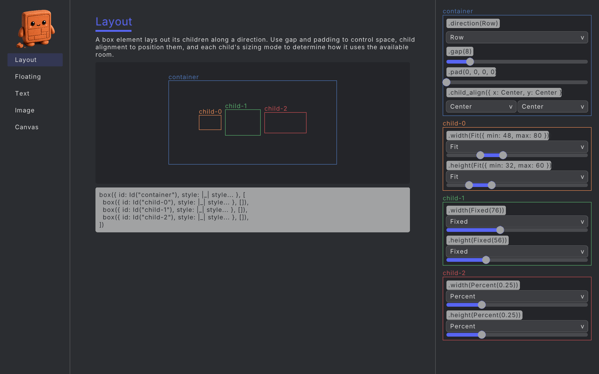

# Terrocotta - Clay meets Roc

<div align="center">
    
</div>

Terrocotta is a library for building native applications in [Roc](https://roc-lang.org/).

It is an experimental project used to explore Roc, immediate-mode
UI architecture, layout, rendering, and native application development. Its API
is still evolving.

<p align="center">
  
</p>

<p align="center"><em>Screwbot — a live 3D inverse-kinematics workbench.</em></p>

## Features

- Model-View-Update (MVU) architecture.
- [Clay](https://github.com/nicbarker/clay) layout engine ported to Roc.
  - [x] Stack-based node layout (capacity + exponential growth allocation)
  - [x] Flexbox
  - [x] Mouse/Keyboard Events
  - [x] Scrollable
  - [x] Text wrapping
  - [x] Text measurement caching
  - [x] Floating
  - [ ] Transitions
- Rendering: [roc-ray](https://github.com/lukewilliamboswell/roc-ray) platform built on [raylib](https://www.raylib.com/).
- [x] Status based styling (hovered/pressed/focused)
- [x] Theming
- Widgets
  - [x] Button
  - [x] Slider
  - [x] Checkbox
  - [x] Color picker
  - [x] Toggle
  - [x] Select
  - [x] Text input

NB: Theming and widgets are just proof of concept implementations. Users are expected to build their own UI toolkit on top of the three fundamental elements: `box(attributes, children)`, `text(content)`, and `canvas(callback)` elements.

## Documentation

- [Architecture Overview](docs/architecture.md)
- [Text Measurement Cache](docs/text_cache.md)

## Examples

Quick counter example:

```roc
import terrocotta.Element exposing [box, text, style]
import terrocotta.Program exposing [View]

AppModel : { count : I32 }

Msg : [Decrement, Increment]

init! : Config => Try(AppModel, [Exit(I64), ..])
init! = |_config| Ok({ count: 0 })

update! : AppModel, Msg => AppModel
update! = |model, msg| match msg {
	Decrement => { ..model, count: model.count - 1 }
	Increment => { ..model, count: model.count + 1 }
}

white = 0xFFFFFF.Color
blue = 0x2196F3.Color

button : Str, Msg -> View(Msg)
button = |label, msg| {
	box(
		{
			id: Auto,
			style: |status| style
				.width(Fit({}))
				.pad(8, 8, 8, 8)
				.background(if status.hovered { blue.darken(50) } else { blue })
				.font_color(white)
				.font_size(16),
			events: [OnClick(msg)],
		},
		[
			text(label),
		],
	)
}

view : AppModel -> View(Msg)
view = |model| {
	box(
		{ style: |_| style.direction(Row).height(Fit({})).gap(8).font_size(16) },
		[
			button("-", Decrement),
			text("Count: ${model.count.to_str()}"),
			button("+", Increment),
		],
	)
}
```

### More examples

<table>
  <tr>
    <td align="center">
        <strong>Counter</strong>
        
    </td>
    <td align="center">
        <strong>Todos</strong><br />
      
    </td>
  </tr>
  <tr>
    <td align="center" colspan="2">
        <strong>Widgets</strong>
      
    </td>
  </tr>
</table>

Run the examples with:

- `roc examples/counter.roc`: key and pointer event handling
- `roc examples/todos.roc`: nested components, input-text/toggle state management
- `roc examples/widgets.roc`: button, toggle, checkbox, slider, text-input
- `roc examples/tutorial/main.roc`: interactive tutorial on layout, floating, text, image, canvas
- `roc examples/screwbot/main.roc`: a CAD-like app demo

### Interactive tutorial

Explore layout, floating elements, text, images, and canvas rendering in the interactive tutorial:

<p align="center">
  
</p>
