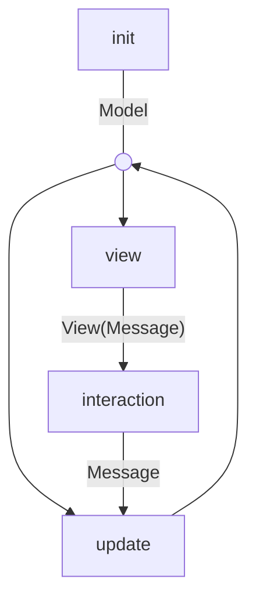

# Architecture

Terrocotta is a native UI runtime for Roc applications. It combines a
Model-View-Update application loop with an immediate mode layout and rendering pipeline.

## Model-View-Update

Applications define their state and behavior through three functions:

- `init: () -> Model`, which creates the initial model (aka application state).
- `view: Model -> View(Message)`, which derives the current UI from the model.
- `update: Model, Message -> Model`, which applies application messages to the model.

The runtime owns the feedback loop around those functions:



## Model

The model is the durable application state. It is created once by `init` and
then carried through the runtime loop.

```roc
Model : { count : I32 }

init : () -> Model
init = () -> { count : 0 }
```

## Update

`update` is the only place where application messages change that state. It
receives the current model and one `Message`, then returns the next model:

```roc
Message : [Increment]

update : Model, Message -> Model
update = |model, message|
    match message {
        Increment -> { count : model.count + 1 }
    }
```

## View

Application code builds a `View` from the built-in `box` and `text` elements,
plus `custom` leaves. Element and Layout remain generic over the leaf payload,
but the standard Program binds that parameter to its closed `Program.Payload`
union. `image` is a convenience wrapper around `custom(Image(value))`; it uses
structural `width` and `height` fields to configure a containing box but does
not add an image-specific layout node.

For example, this view derives UI from a small model and attaches an event that
can produce an application message:

```roc
view : Model -> View(Message)
view = |model|
    box({ style: |_| container_style }, [
        text(model.count.to_str()),
        box({ id: Id("increment"), style: |_| button_style, events: [OnClick(Increment)] }, [
            text("+"),
        ]),
    ])
```

The application-facing `Program.View(msg)` aliases the generic element view
with the program's supported payload type:

```roc
Program.View(msg) : Element.View(msg, Program.Payload)
```

This ensures the view's payload type unifies with `Program.Payload`, leaving
only the message type parameter exposed to applications.

Internally, the generic `Element.View(msg, payload)` is not a retained tree
data structure. It is an iterator of `ElementOp(msg, payload)` values:

```roc
View(msg, payload) : Iter(ElementOp(msg, payload))

ElementOp(msg, payload) : [
    OpenBox(BoxStatus -> BoxConfig, List(Event(msg))),
    CloseBox,
    Text(Str),
    Custom(payload),
]
```

That means the view above is emitted as a flat stream:

```roc
OpenBox(|_| container_style, [])
Text("0")
OpenBox(|_| button_style, [OnClick(Increment)])
Text("+")
CloseBox
CloseBox
```

## Layout

`Layout(payload)` consumes the `ElementOp(msg, payload)` iterator and builds a
flat contiguous node list.

At a high level, a layout node looks like this:

```roc
Layout(payload) : {
    nodes : List(LayoutNode(payload)),  # flat list of layout nodes
    stack : List(U64),  # stack of parent node indices
}

LayoutNode(payload) : {
    kind : [BoxNode, TextNode, CustomNode({ payload : payload })],
    parent : [NoParent, Parent(U64)],
    child_start : U64,
    child_count : U64,
    position : { x : U64, y : U64 },
    size : { width : U64, height : U64 },
    ...
}
```

The push/pop shape of the view iterator lets `Layout` build this representation
incrementally. `OpenBox` pushes a parent onto the layout stack, leaf messages add
children to the current parent, and `CloseBox` pops the stack.

Once the node list is built, layout solving fills in concrete sizes and
positions. Custom leaves are opaque, have zero intrinsic size, and grow into
the content bounds assigned by their parent box. Applications express natural
size or aspect-ratio policy by wrapping a custom leaf in an explicitly sized
box.

The flat representation is critical for performance. Rebuilding the UI each
frame does not require allocating a tree of heap objects; the runtime can reuse contiguous lists, append nodes in stream order, and walk layout data with good cache locality when solving constraints.

The layout implementation is a direct port of [Clay](https://github.com/nicbarker/clay) to Roc.

## Rendering

Rendering starts after layout has been solved. At that point, every layout node
has concrete position and size data.

`Renderer.draw!` uses the scoped recursive traversal and the host's
`with_scissor!` operation:

```roc
Renderer.draw!(frame, layout, screen)
```

As an alternative, `Paint.iter` converts the solved layout into a validated,
back-to-front stream of semantic paint operations. `Renderer.draw_paint!`
interprets that stream using push/pop scissors:

```roc
Renderer.draw_paint!(frame, layout, screen)
```

Both paths use the same background, text, border, and payload drawing functions.
They preserve root and child paint order, use conservative subtree bounds for
culling, and exhaustively interpret `Program.Payload` at each resolved
`Renderer.Placement`.
The linear path emits balanced `BeginScissor` and `EndScissor` operations and
maps them to `frame.begin_scissor!` and `frame.end_scissor!`.

## Runtime

At a high level, the runtime frame loop looks like this:

```roc
$model = init()
$layout = Layout.new()
$bindings = []

while Bool.True {
    $layout = $layout.clear()
    $bindings = $bindings.clear()

    # build layout from stream of ElementOp: [OpenBox(_, _), Text, Custom, CloseBox]
    for element_op in view($model) {
        $layout = $layout.update!(element_op)
        $bindings = collect_event_bindings($bindings, $layout, element_op)
    }

    # solve layout constraints
    $layout = $layout.solve!()

    # update model
    messages = user_interactions($layout, $bindings, host)
    for message in messages {
        $model = update($model, message)
    }

    # render layout
    render!($layout)
}
```
