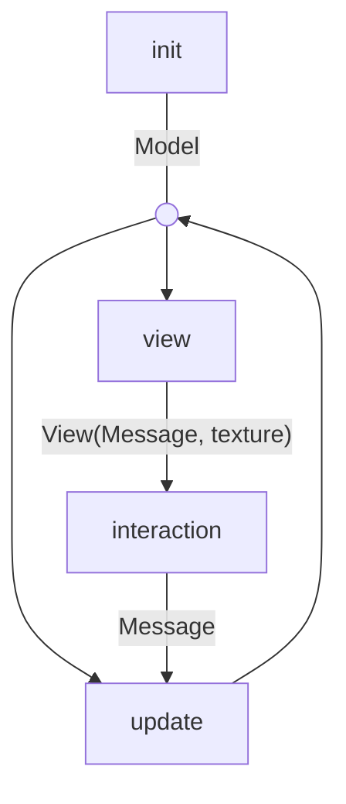

# Architecture

Terrocotta is a native UI runtime for Roc applications. It combines a
Model-View-Update application loop with an immediate mode layout and rendering pipeline.

## Model-View-Update

Applications define their state and behavior through three functions:

- `init: () -> Model`, which creates the initial model (aka application state).
- `view: Model -> View(Message, texture)`, which derives the current UI from the model.
- `update: Model, Message -> Model`, which applies application messages to the model.

The runtime owns the feedback loop around those functions:



## Model

The model is the durable application state. It is created once by `init` and
then carried through the runtime loop.

```roc
Model : { count : I32 }

init : () -> Model
init = () -> { count : 0 }
```

## Update

`update` is the only place where application messages change that state. It
receives the current model and one `Message`, then returns the next model:

```roc
Message : [Increment]

update : Model, Message -> Model
update = |model, message|
    match message {
        Increment -> { count : model.count + 1 }
    }
```

## View

Application code builds a `View` out of 3 fundamental elements: `box`, `text` and
`image`.

For example, this view derives UI from a small model and attaches an event that
can produce an application message:

```roc
view : Model -> View(Message, texture)
view = |model|
    box({ style: |_| container_style }, [
        text(model.count.to_str()),
        box({ id: Id("increment"), style: |_| button_style, events: [OnClick(Increment)] }, [
            text("+"),
        ]),
    ])
```

The important point is that a `View(msg, texture)` is not a retained tree data
structure. It is an iterator of `ElementOp(msg, texture)` values:

```roc
View(msg, texture) : Iter(ElementOp(msg, texture))

ElementOp(msg, texture) : [
    OpenBox(BoxStatus -> BoxConfig, List(Event(msg))),
    CloseBox,
    Text(Str),
    Image(texture),
]
```

That means the view above is emitted as a flat stream:

```roc
OpenBox(|_| container_style, [])
Text("0")
OpenBox(|_| button_style, [OnClick(Increment)])
Text("+")
CloseBox
CloseBox
```

## Layout

`Layout(texture)` consumes the `ElementOp(msg, texture)` iterator and builds a
flat contiguous node list.

At a high level, a layout node looks like this:

```roc
Layout(texture) : {
    nodes : List(LayoutNode(texture)),  # flat list of layout nodes
    stack : List(U64),  # stack of parent node indices
}

LayoutNode(texture) : {
    kind : [BoxNode, TextNode, ImageNode({ texture : texture })],
    parent : [NoParent, Parent(U64)],
    child_start : U64,
    child_count : U64,
    position : { x : U64, y : U64 },
    size : { width : U64, height : U64 },
    ...
}
```

The push/pop shape of the view iterator lets `Layout` build this representation
incrementally. `OpenBox` pushes a parent onto the layout stack, leaf messages add
children to the current parent, and `CloseBox` pops the stack.

Once the node list is built, layout solving fills in concrete sizes and
positions.

The flat representation is critical for performance. Rebuilding the UI each
frame does not require allocating a tree of heap objects; the runtime can reuse contiguous lists, append nodes in stream order, and walk layout data with good cache locality when solving constraints.

The layout implementation is a direct port of [Clay](https://github.com/nicbarker/clay) to Roc.

## Rendering

Rendering starts after layout has been solved. At that point, every layout node
has concrete position and size data.

`Renderer.draw!` traverses the solved node list in paint order and sends semantic
operations directly to the host frame:

```roc
Renderer.draw!(frame, layout, screen)
```

The traversal computes conservative subtree paint bounds for culling, preserves
root and child paint order, scopes clipped descendants with
`frame.with_scissor!`, and delegates background, text, image, and border
primitives to `Renderer`.

## Runtime

At a high level, the runtime frame loop looks like this:

```roc
$model = init()
$layout = Layout.new()
$bindings = []

while Bool.True {
    $layout = $layout.clear()
    $bindings = $bindings.clear()

    # build layout from stream of ElementOp: [OpenBox(_, _), Text, Image, CloseBox
    for element_op in view($model) {
        $layout = $layout.update!(element_op)
        $bindings = collect_event_bindings($bindings, $layout, element_op)
    }

    # solve layout constraints
    $layout = $layout.solve!()

    # update model
    messages = user_interactions($layout, $bindings, host)
    for message in messages {
        $model = update($model, message)
    }

    # render layout
    render!($layout)
}
```
